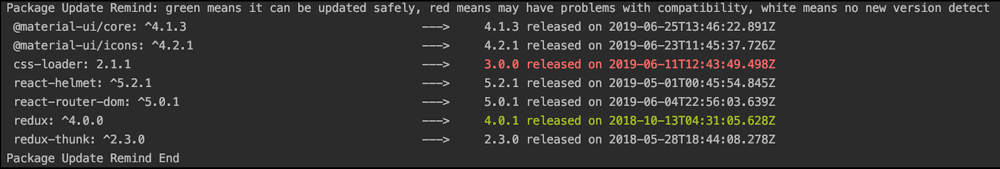

# A webpack plugin can check package versions, combine package.json, auto update.

## Install

`npm i --save-dev webpack-package-manager`

## Start

```JavaScript
const PackageUpdatePlugin = require('webpack-package-manager');
module.exports = {
    plugins:[new PackageUpdatePlugin()]
}
```
In command line when compiling, it wll show like:




## Options

```JavaScript
const PackageUpdatePlugin = require('webpack-package-manager');
new PackageUpdatePlugin({
    onlyShowAvailable: false,                   
    //whether show the packages that don't need to update, default is false
    autoUpdate:false,                           
    //whether automatically update the packages detected to update, default is false
    showReleaseTime:true,                       
    //whether show latest release time, default is true
    updateFrom:['<other path>/package.json']    
    //an array, the paths that other package.json files you want to combine, if set this options, 
    //the latest version showing will be the highest version among all files instead of npm latest
})
```

If you have issues or want to make some suggestions, welcome to contact me. 
